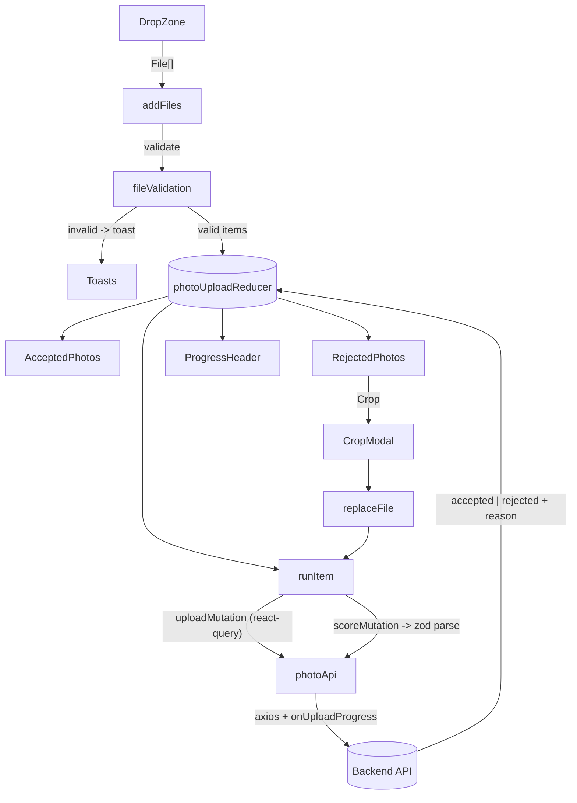

# Aragon - Photo Upload

A modular, production-minded photo-upload experience inspired by Aragon.ai. Users
drag-and-drop or pick multiple images; the app validates them on the client,
uploads each file with live progress, and the backend scores them into
**Accepted** and **Rejected** sections (with human-readable reasons). Rejected
photos can be re-cropped and re-uploaded in place.

---

## Why

AI headshot/avatar products live or die by the quality of the photos a user
uploads. This screen is the funnel's most important step, so it needs to:

- Stop bad files **before** they hit the network (wrong format, too large).
- Give **continuous, honest feedback** (per-file progress, success, and the
  exact reason a photo was rejected).
- Make fixing a rejected photo trivial (crop + retry) so users reach the minimum
  number of good photos without dropping off.

## What

- Multi-file upload via drag-and-drop or file picker.
- Client-side validation: **PNG, JPEG, HEIC/HEIF**, up to **120 MB** each.
- Per-file lifecycle: `pending -> uploading -> processing -> accepted | rejected | error`.
- Real-time feedback: progress bar, toasts, inline rejection reasons with tooltips.
- **Accepted Photos** and **Some Photos Didn't Meet Our Guidelines** sections.
- In-place **crop & re-upload** for fixable rejections.
- Memory-safe previews (object URLs are revoked on remove/unmount) and cancelable
  uploads (`AbortController`).

## Where

Single-page app, single screen (`PhotoUploader`). It is backend-agnostic: the UI
talks to a small, typed service layer (`photoApi`) that can point at any backend
via `VITE_API_BASE_URL`, or be swapped for a mock in tests.

## How (architecture)



**Separation of concerns**

| Layer        | Responsibility                                  | Location |
| ------------ | ----------------------------------------------- | -------- |
| UI           | Presentational components                       | `features/photo-upload/components`, `components/ui` |
| Orchestration| State machine + side effects                    | `features/photo-upload/hooks/usePhotoUpload.ts` |
| State        | Pure reducer + actions                          | `features/photo-upload/state` |
| Validation   | Pure, framework-free file checks                | `features/photo-upload/validation` |
| Data/IO      | HTTP, response schemas, progress                | `features/photo-upload/services` |
| Design system| shadcn/ui primitives + tokens                   | `components/ui`, `src/index.css` |

## Tech stack

- **React 19** + **TypeScript** + **Vite 8**
- **Tailwind CSS v4** with a shadcn/ui token system (`@theme inline`)
- **shadcn/ui** components on **Radix UI** (`dialog`, `tooltip`, `progress`, `slot`)
  with **class-variance-authority**, **clsx**, **tailwind-merge**
- **lucide-react** icons
- **TanStack Query (react-query)** for the upload/score async layer (+ Devtools in dev)
- **axios** for HTTP (native upload progress) and **zod** for response validation
- **react-dropzone** for drag-and-drop
- **react-cropper** + **cropperjs** for cropping
- **react-hot-toast** for notifications

### Why these (package selection)

The candidate dependency list was triaged against this feature:

- **Adopted:** react-dropzone, react-cropper + cropperjs, axios, zod, react-query
  (+ devtools), react-hot-toast, lucide-react, the shadcn foundation
  (cva/clsx/tailwind-merge) and Radix primitives (dialog/tooltip/slot/progress).
- **Available for later:** Radix label/popover/dropdown/select (forms/menus),
  @dnd-kit (reorder photos), react-window (virtualization), Sentry (error
  monitoring), PostHog (funnel analytics), zustand (the local reducer suffices),
  react-hook-form (no forms yet).
- **Out of scope:** charting (chart.js, recharts, topojson), rich text (lexical),
  dates (date-fns, react-day-picker), markdown, media players, routing,
  data-tables, maps, PDF, etc.

## Project structure

```
src/
  components/ui/            # shadcn/ui design-system primitives
    button.tsx  card.tsx  dialog.tsx  progress.tsx  tooltip.tsx
    spinner.tsx  toaster.tsx
  config/
    env.ts                  # typed access to VITE_* env
  features/photo-upload/
    components/             # DropZone, PhotoCard, Accepted/Rejected, CropModal...
    hooks/usePhotoUpload.ts # orchestrator (reducer + react-query mutations)
    services/photoApi.ts    # axios + zod, PhotoApi interface
    state/                  # reducer + actions
    validation/             # pure file validation
    constants.ts  types.ts  index.ts
  lib/
    utils.ts (cn)  format.ts  queryClient.ts
  App.tsx  main.tsx  index.css
```

## API contract

Configure the base URL with `VITE_API_BASE_URL` (defaults to `/api`).

```
POST {BASE}/photos          # multipart, field "file"   -> { id, url }
POST {BASE}/photos/score    # body { ids: string[] }     -> ScoreResult[]
```

```ts
type ScoreResult =
  | { id: string; status: 'accepted' }
  | { id: string; status: 'rejected';
      reason: 'blurry_face' | 'face_too_far' | 'too_similar' | 'no_face' | 'unsupported' };
```

Responses are validated at runtime with zod, so a malformed payload fails loudly
rather than corrupting the UI. To run against a mock, implement the `PhotoApi`
interface (`services/photoApi.ts`) and inject it via `usePhotoUpload({ api })`.

## Getting started

```bash
npm install

# point at your backend (optional; defaults to /api)
cp .env.example .env

npm run dev      # start the dev server
npm run build    # type-check + production build
npm run lint     # eslint
npm run preview  # preview the production build
```

## Design system

Design tokens live in `src/index.css`. Raw values are declared on `:root`
(`--background`, `--foreground`, `--primary`, `--border`, brand orange scale,
`--radius`, ...) and exposed as Tailwind utilities through `@theme inline`
(`bg-background`, `text-muted-foreground`, `bg-primary`, `rounded-lg`,
`bg-brand-500`, ...). Because the project uses standard shadcn conventions
(`components.json`, `@/` alias, `cn` helper), new primitives can be added with
`npx shadcn@latest add <component>`.

## Notable implementation decisions

- **State machine via `useReducer`** with a discriminated-union status keeps every
  item's lifecycle explicit and impossible to represent invalidly.
- **react-query mutations** wrap upload + score to provide a single async boundary
  and Devtools visibility, while per-item UI state stays in the reducer.
- **axios `onUploadProgress`** powers real per-file progress (the reason we don't
  use bare `fetch`).
- **Cropped output is normalized to JPEG** because HEIC cannot be encoded to a
  `<canvas>` in the browser.
- The crop modal and React Query Devtools are **lazy-loaded** to keep the initial
  bundle lean.
```
